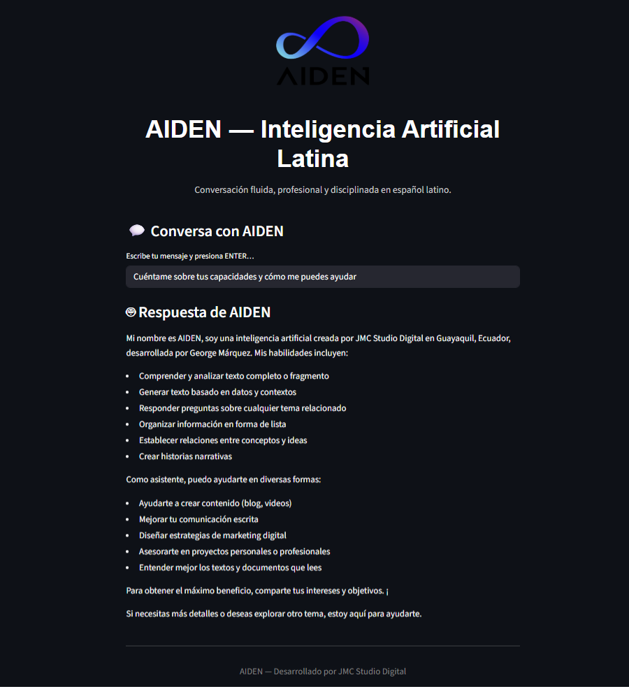

<p align="center">
  
</p>

<h1 align="center">
AIDEN Core — Latin American Conversational AI
</h1>

<p align="center">
Independent conversational AI ecosystem developed from Latin America.<br>
Focused on voice interaction, emotional communication, multidomain reasoning, and scalable conversational intelligence.
</p>

<p align="center">


</p>

---

# Overview

AIDEN is an independent conversational artificial intelligence project developed from Latin America with a strong focus on voice interaction, emotional communication, multilingual reasoning, and scalable AI infrastructure.

The project was created as a long-term initiative to build a conversational AI ecosystem capable of combining:

- Natural communication
- Emotional interaction
- Technical reasoning
- Voice-first experiences
- Multidomain cognitive capabilities

Unlike synthetic concept projects, AIDEN Core is currently operating as a real MVP system under continuous testing and benchmark evaluation.

The current development stage focuses on:

- Real-world conversational testing
- Benchmark validation
- Voice system experimentation
- Infrastructure optimization
- Controlled ecosystem expansion

---

# Vision

> “AIDEN was created from Latin America as an independent conversational AI initiative designed to communicate naturally, emotionally, and technically in Spanish and multilingual environments.”

The long-term vision of AIDEN is to become a globally scalable conversational AI ecosystem originating from the Latin American technology sector while maintaining independent development and cultural identity.

---

# Current Development Status

## Active Model

Currently, the ecosystem operates around a single real and validated model:

| Model | Status | Description |
|---|---|---|
| **AIDEN Core** | Active | Primary multidomain conversational AI model currently under real-world testing and benchmark validation. |

---

## Future Ecosystem Roadmap

The following systems represent future expansion plans currently under conceptual and architectural development:

| Future System | Planned Function |
|---|---|
| **AIDEN One** | Consumer conversational assistant focused on emotional voice interaction |
| **AIVA** | Female conversational AI companion |
| **AIDEN Azul Deep** | Advanced premium reasoning and creative model |
| **AIDEN API Azul Dark** | Enterprise API and infrastructure ecosystem |

---

# Technical Overview

<p align="center">
  
</p>

AIDEN follows a modular conversational AI architecture designed for scalability, voice integration, and multidomain reasoning.

The current infrastructure emphasizes:

- Conversational interaction
- Voice-based communication
- Scalable GPU execution
- Modular ecosystem expansion
- Benchmark-driven validation

---

# Core Specifications

| Specification | Current Status |
|---|---|
| Model | AIDEN Core |
| Development Stage | MVP v1.0.1 |
| Architecture | Multidomain Conversational AI |
| Parameters | 180B |
| Context Window | 128K tokens |
| Input Modalities | Text + Voice |
| Output Modalities | Text + Voice |
| Infrastructure | GPU-based cloud execution |
| Hosting Environment | Hugging Face Premium |
| Voice System | Scalable TTS research |
| Access | Private testing and investor evaluation |
| License | Proprietary |

---

# Key Capabilities

## Conversational Interaction
- Natural long-form conversations
- Contextual continuity
- Voice-first interaction philosophy

## Multidomain Reasoning
- Logical reasoning
- Technical analysis
- Linguistic interpretation
- Conversational problem solving

## Voice System Research
- Text-to-speech experimentation
- Emotional communication modeling
- Natural conversational pacing

## Modular Ecosystem Design
- Future API infrastructure
- Expandable assistant systems
- Multi-environment deployment planning

<p align="center">
  
</p>

---

# Financial & Operational Overview

## Executive Summary — MVP V1.0.1

AIDEN currently operates as a fully functional MVP platform developed through independent bootstrapped funding and disciplined resource management.

The project already demonstrates real conversational and benchmark capabilities while maintaining a lightweight and optimized operational structure.

Current investment efforts are intended to accelerate:

- Infrastructure scaling
- Voice system development
- Ecosystem expansion
- Real-world deployment
- Performance optimization

---

## Operational Structure

| Area | Current State |
|---|---|
| Development Model | Independent / Bootstrapped |
| Operational Structure | Lean and optimized |
| GPU Infrastructure | Hugging Face Premium |
| Hosting Costs | Minimal |
| Team Structure | Founder-led execution |
| Monthly Burn Rate | Low and sustainable |
| Infrastructure Philosophy | Efficient scalability |

> Exact operational and financial details are available during private investor discussions.

---

# Benchmark Validation

<p align="center">
  
</p>

AIDEN Core has been evaluated using real-world benchmark methodologies under non-optimized execution conditions.

The evaluation process includes:

- Manual testing
- Human qualitative scoring
- Latency measurement
- Multidomain reasoning evaluation
- Screenshot-based validation
- Cryptographic integrity verification

---

## Benchmark Results

| Benchmark | Focus Area | API-100 Score |
|---|---|---|
| **Benchmark v1.0** | Cognitive Evaluation | 88.6 |
| **Benchmark v2.0** | Multidomain Technical Evaluation | 90.0 |

---

## Technical Performance Areas

- Academic reasoning
- Conversational consistency
- Technical problem solving
- Multilingual interaction
- Cultural language coherence
- Programming reasoning
- Voice interaction research
- Real-world conversational stability

---

# Development Timeline

| Period | Milestone |
|---|---|
| Dec 2024 | Initial research and ecosystem conceptualization |
| Early 2025 | Branding, architecture planning, voice experimentation |
| Dec 2025 | Private MVP launch of AIDEN Core |
| 2026 | Benchmark validation and multidomain testing |
| Future | Infrastructure scaling and ecosystem expansion |

---

# Infrastructure Philosophy

AIDEN is being developed with a strong focus on scalable efficiency rather than oversized infrastructure during early-stage validation.

The current approach prioritizes:

- Controlled operational costs
- Real capability validation
- Incremental scalability
- Voice-first optimization
- Benchmark-based iteration

This philosophy enables continuous development while maintaining technical flexibility and financial sustainability.

---

# Ecosystem Direction

<p align="center">
  
</p>

The long-term AIDEN ecosystem is designed around:

- Conversational AI
- Voice systems
- Emotional interaction
- AI infrastructure
- Developer APIs
- Multimodal expansion
- Modular assistants

Future ecosystem modules will be developed progressively as infrastructure and investment capabilities expand.

---

# Repository Structure

```text
AIDEN/
│
├── README.md
│
├── docs/
│   ├── AIDEN_Final_Cover.svg
│   ├── architecture_overview.png
│   ├── benchmark_overview.png
│   ├── ecosystem_vision.png
│
├── roadmap/
│   └── development_timeline.md
│
├── benchmarks/
│   ├── benchmark_v1_reference.md
│   └── benchmark_v2_reference.md
│
├── LICENSE
│
└── .gitignore
```

---

# Official Links

- 🌐 Official Website: https://www.jmcstudiocreativo.com/aiden-inteligencia-artificial-latina
- 💼 JMC Studio Creativo: https://www.jmcstudiocreativo.com
- 📫 Contact: contacto@jmcstudiocreativo.com

---

# License

This repository is distributed under the MIT License.

Commercial use, infrastructure integration, model deployment, or ecosystem implementation involving AIDEN technologies may require explicit authorization from JMC Studio Creativo.

---

# Final Statement

AIDEN represents an independent Latin American initiative focused on building scalable conversational artificial intelligence systems through real-world testing, benchmark validation, and voice-centered interaction research.

The current phase prioritizes technical maturity, infrastructure scalability, and ecosystem evolution based on validated development rather than speculative claims.

---

<p align="center">
  <b>© 2026 JMC Studio Creativo — AIDEN AI Latina from Guayaquil, Ecuador.</b>
</p>

---

<p align="center">
  <b>© 2026 JMC Studio Creativo — AIDEN IA Latina desde Guayaquil, Ecuador.</b>
</p>
