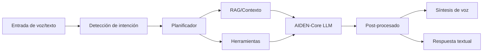

  

---

# Arquitectura de Referencia — AIDEN-Core

**Versión:** 0.1 (documento vivo)  
**Ámbito:** Diseño lógico del *core* conversacional, canal de voz, memoria contextual y ruteo de herramientas.

## 1) Visión general

AIDEN-Core es el **modelo base de lenguaje** del ecosistema AIDEN, optimizado para:
- 🎙️ **Conversación por voz** (principal) y ✍️ **entrada por texto**.
- 🧠 **Memoria contextual** multimodal corta y extendida.
- 🧩 **Orquestación de herramientas** (funciones/agents) bajo políticas de seguridad.

## 2) Capas del sistema

1. **Capa de Interfaz**: captura de voz, transcripción, normalización lingüística y detección de intención.
2. **Capa de Razonamiento**: planificación paso a paso, verificación y corrección de respuestas.
3. **Capa de Conocimiento**: recuperación de contexto (RAG), perfiles de usuario y restricciones de dominio.
4. **Capa de Acción**: invocación de herramientas (search, code, data, gen-imagen/video) con *safety guards*.
5. **Capa de Salida**: *post-processing* semántico y **síntesis de voz** de alta naturalidad.

## 3) Memoria y contexto

- **Ventana base**: 32K tokens (AIDEN One), ampliable en Azul Deep (500K) y Azul Dark API (1M).  
- **Memoria de usuario**: perfiles, preferencias, *consent logs*.  
- **Memoria episódica**: sesiones recientes por conversación.  
- **Memoria semántica**: embeddings, resúmenes y anclajes temáticos.

## 4) Seguridad y cumplimiento

- Controles de **privacidad por diseño** (consentimiento explícito, anonimización).  
- **Filtros de seguridad** (contenido sensible), *rate limiting* y auditoría de herramientas.  
- Versionado de prompts de sistema e instrucciones de dominio.

---

© 2025 JMC Studio Creativo — AIDEN. Uso interno y para evaluación de inversionistas.
